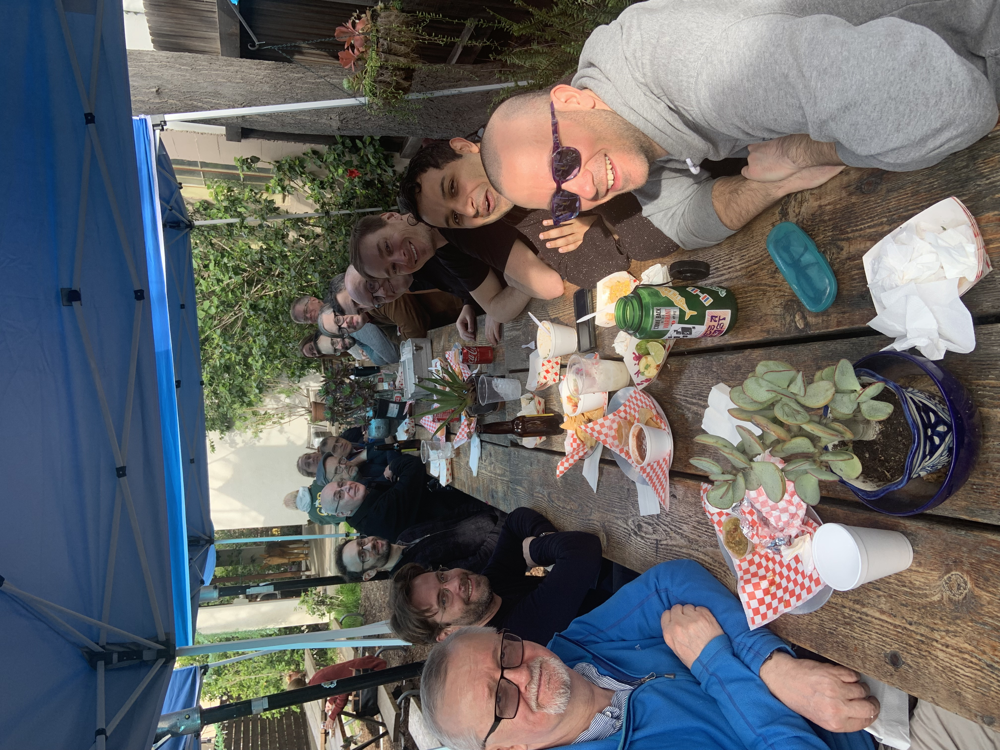

# Claremont 2023

{: style="padding:1em;" }
<small>Photo credit: Kim Bruce.</small>

We are meeting at Pomona College in Claremont, CA, USA from January 9th through January 13th.

Our meetings will be held in Edmunds Hall, 185 E. Sixth St., Claremont, CA 91711.

<iframe src="https://www.google.com/maps/embed?pb=!1m18!1m12!1m3!1d3303.815061007863!2d-117.71538884838745!3d34.09987788049773!2m3!1f0!2f0!3f0!3m2!1i1024!2i768!4f13.1!3m3!1m2!1s0x80c331bf67e5306d%3A0x567764746786e7c1!2sEdmunds%2C%20185%20E%206th%20St%2C%20Claremont%2C%20CA%2091711!5e0!3m2!1sen!2sus!4v1670355202825!5m2!1sen!2sus" width="500" height="450" style="border:0;" allowfullscreen="" loading="lazy" referrerpolicy="no-referrer-when-downgrade"></iframe>

## Getting There

ONT is by far the preferable airport, though there will be few (if any)
flights into it from further east than Denver.

LAX is an easy destination, especially for international folks. There
are a variety of shuttle services as well as the usual private taxis
and ubers---you can either go all the way to Claremont, or take the
LAX FlyAway shuttle to LA Union Station and then take a train. (Do
_not_ take the train to Pomona, which is a different nearby town on a
different train line.) The train only runs once per hour and stops
running at 9:38pm ([full Sunday schedule](https://metrolinktrains.com/schedules/?type=station&originId=107&destinationId=114&weekend=4)).  If you will take the train, download the
metrolink app so you can buy your ticket in advance (e.g., while
riding the bus).  Uber and Lyft are also reasonable to take, but will
cost abou $75 to $100 depending on traffic and require you to take a
shuttle to a parking lot before calling the car.

Santa Ana (SNA) and Burbank (BUR) are also worth considering, as they
will avoid having to traverse the most heavily trafficked parts of
LA's horrible highway system.

Once you're in Claremont, there's no need for a car (unless you want
to explore the mountains to the north or the desert to the east).

## Accommodations

There are two hotels in town that make sense to use:

  - The Doubletree
    https://www.hilton.com/en/hotels/ontcldt-doubletree-claremont/
    1.1mi walk to Edmunds (where we'll be meeting)

  - Casa 425
    https://www.casa425.com/
    0.7mi walk to Edmunds

The Doubletree is a bit cheaper, but is in a kind of blah north side of
town. (The piano bar next door is great if you like bad bars.) Casa 425
is substantially pricier, but is in the cute village downtown.

We haven't reserved a room block---the Doubletree had a penalty clause
they wouldn't relent on---but there should be plenty of rooms. There are
also AirBnBs in the area. The Clarmeont Lodge and Motel 6 down by the
highway are discouraged (long walk, crappy part of town---but not
unsafe).

## Schedule

We met Monday through Thursday, with an outing at CalBG on Wednesday
afternoon. Friday was dedicated to
[Brucefest](https://kimbruce.party), a retirement party in Kim Bruce's
honor.

## Talks

### Manuel Serrano: Highly Illogical, Kirk: Spotting Type Mismatches in the Large Despite Broken Contracts, Unsound Types, and Too Many Linters

The DefinitelyTyped repository hosts type declarations for thousands of
JavaScript libraries. Given the lack of formal connection between the
types and the corresponding code, a natural question is <i>are the types
right?</i> An equally important question, as DefinitelyTyped and the
libraries it supports change over time, is <i>how can we keep the types
from becoming wrong?</i>

In this paper we offer Scotty, a tool that detects mismatches between
the types and code in the Definitely-Typed repository. More
specifically, Scotty checks each package by converting its types into
contracts and installing the contracts on the boundary between the
library and its test suite. Running the test suite in this environment
can reveal mismatches between the types and the JavaScript code. As
automation and generality are both essential if such a tool is going to
remain useful in the long term, we focus on techniques that sacrifice
completeness, instead preferring to avoid false positives. Scotty
currently handles about 26% of the 8006 packages on DefinitelyTyped (61%
of the packages whose code is available and whose test suite passes).

Perhaps unsurprisingly, running the tests with these contracts in place
revealed many errors in Definitely-Typed. More surprisingly, despite the
inherent limitations of the techniques we use, this exercise led to one
hundred accepted pull requests that fix errors in DefinitelyTyped,
demonstrating the value of this approach for the long-term maintenance
of DefinitelyTyped. It also revealed a number of lessons about working
in the JavaScript ecosystem and how details beyond the semantics of the
language can be surprisingly important. Best of all, it also revealed a
few places where programmers preferred incorrect types, suggesting some
avenues of research to improve TypeScript.

### Gilad Bracha: Docucentric Programming in Ampleforth

Ampleforth is an editor for rich text documents with embedded media, including arbitrary interactive user interface elements. Originally created to support live literate programming in  Newspeak, Ampleforth is evolving into a tool for Docucentric programming. 

Ampleforth documents can range from simple texts to rich interactive applications.  The editor simultaneously serves as both a general-purpose application builder and the resulting application. Document transclusion provides a natural mechanism for integrating different applications. 

Ampleforth documents are objects and therefore naturally have a dynamic scope which can be used to reference live objects within them. Documents then mesh naturally with exemplar support in the IDE, making it easy to write code in the scope of the document and evaluate it live at any point. 

The system allows for either WYSIWYG or markup editing (or a mix of both), and maintains a live bidirectional relation between the two.  The editor is written in the Newspeak programming language, and incorporates a complete Newspeak IDE, enabling Ampleforth to be scripted and modified live within itself. 

Ampleforth has the potential to subsume a wide variety of tools such as word processors, presentation managers, computational notebooks, messaging apps etc. 
Future work includes extending Ampleforth with support for local-first programming, and extend documents to 3D spaces.

### Michael Greenberg: Answer set programming (ASP) is the powerhouse technology you’ve never heard of

These days, SMT is a go-to for PL tooling. And it’s great! But SMT is just one way to extend SAT. Answer set programming extends SAT in a different way, with different strengths and weaknesses. I’ll tell you about ASP, some experience I’ve had with it, and how you can add it to your toolbox.

### Lindsey Kuper: Causally ordered communication, cooked three ways

In distributed systems in which participants communicate by message passing, it's often in good taste to ensure that messages are delivered in causal order.  A typical way to enforce causally-ordered message delivery is on the message recipient's end: recipients queue incoming messages until all causally preceding messages have been received and delivered.  An alternative -- seemingly lesser-used -- approach is to move the enforcement mechanism to the sender's end: senders queue outgoing messages until they've received an acknowledgment of their last sent message.  Both the receiver-side and sender-side approaches involve tradeoffs around message metadata overhead, message latency, and scalability to large numbers of participants.  We'll weigh these tradeoffs in the context of two classic protocols from the early 90s, one of each flavor.  Then we'll consider a fusion of the two approaches' strengths and discuss what might be done at the language level to open up new design possibilities that weren't on the table when these protocols were first cooked up.

### Daan Leijen: FBIP: Functional-But-In-Place algorithm design in Koka

Building on recent advances in using compiler-guided precise reference counting (called Perceus), reuse analysis, and tail-recursion modulo-cons optimization, we can write certain algorithms in a purely functional style but with the efficiency of imperative algorithms. 
Just like tail-call optimization lets us write loops with regular function calls, reuse analysis lets us write in-place mutating algorithms in a purely functional way. 
I will give an overview on the optimizations performed by the Koka compiler and show some algorithms that lend themselves to this approach. This is still work-in-progress but quite exciting to see what is possible.

### Ben L. Titzer: Virgil

"Systems Programming" is a term often used but rarely rigorously defined. Opinions differ on the right design or features of a programming language that should support systems programming, but one thing is clear; it is a different domain with hard problems. In this talk I will outline my approach to systems programming in the Virgil programming language, a statically-compiled, garbage-collected, and memory-safe language with limited amounts of unsafe features. In particular, Virgil’s design has been driven by the desire to be completely self-hosted (no runtime code written in other languages), to support direct kernel interaction, and to facilitate the implementation of VMs for guest languages. In particular, I’ll outline the new additions I’ve made to Virgil in order to implement the Wizard Research Engine, a flexible engine for WebAssembly.

### Adam Chlipala: Nectry: A no-code platform built on dependently typed combinators

I try to mine the audience’s know-how to figure out how to make progress with my startup ambitions, around what is meant to be a highly usable IDE for programming with dependently typed combinators in Ur/Web, to build enterprise-software apps.  I just want to do some demos of the current prototype system, and we can explore corners I didn’t preplan, based on audience suggestions.  Help me figure out the ideal early adopters of this sort of thing!  Or suggest how to improve usability!  The goal is that people who aren’t software engineers can drive this thing successfully some day soon.

### Tijs van der Storm: Salix: Elm-style Web programming in Rascal, an exercise in library design

Elm is small purely functional language for web-programming designed by Evan Czaplicki. I’ve ported this language to Rascal as an embedded DSL/library. I will discuss some trade-offs and challenges in the design and demonstrate its abilities and limitations. 

### Tobias Wrigstad Three for the Price of One:  Memory management for improving program performance, improving the performance of memory management, and understanding and controlling the impact of memory management on program performance

In my talk, I will introduce you to three different strands of my on-going research on memory management:
– I will talk about mutator-based object relocation for the purpose of ordering objects in memory in a way that improves cache performance;
– I will talk about an approach to collect garbage by delaying object relocation as much as possible to allow objects to essentially garbage-collect themselves for free; and
— I will talk about recent work on a programming language design for making the performance impact of memory management understandable and controllable, and how that let’s programmers combine different memory management strategies in a single program.

### Ross Tate: Revamping and Extending Kotlin’s Type System

Kotlin was released over a decade ago. It has reached a point where its type system would benefit from establishing a solid algorithmic foundation, both for simplifying its implementation and to build new features upon. In particular, the most commonly requested features are support for intersection and union types. I have been working with the team for the last few months in order to understand how Kotlin’s type system is currently being used, what its primary algorithmic challenges are, where there is room for changes, and why these features are being requested. I will present a quick summary of what I have learned so far and the current novel algorithmic approach we currently believe will address these needs in the hopes that the working group can review our conclusions and share their insights and knowledge of related works.

### Cyrus Omar: Hazel: Live and Direct and Abstract and Symbolic

In my talk, I will demonstrate Hazel, a live functional programming environment that uses typed holes to maintain a unique invariant: every editor state is both statically and dynamically meaningful. While Hazel uses a structure editor, our recent work on tile-based editing demonstrates that maintaining structure does not require that the user manipulate the program using tree transformations. Instead, holes and syntactic obligations can be automatically managed by the system so that a well-formed and meaningful state is always available while the user can directly manipulate the textual projection that they are seeing.

I will also introduce our recent work on livelits, which allow one to fill typed holes with live GUIs, a form of graphical macro system. This moves us in the direction of integrating a variety of direct manipulation interfaces into a common framework.

Finally, I will touch on some ongoing work on:

adding collaboration to Hazel using a novel graph CRDT, which models the state of the system as a *set* of edits, i.e. without ordering! This opens up some exciting directions toward manipulating editing history in a first-class manner.
developing an intelligent Hazel Assistant that can integrate a wide variety of sources of information and synthesis techniques to help guide the programmer

Throughout, I will discuss the various design principles that have motivated our work and suggest that language designers take liveness and direct manipulation interfaces seriously if we want to move out of the narrow niches that programming currently occupies in society.

### James Noble: Ten Things I Hate About ν

“I know you can be underwhelmed, and you can be overwhelmed, but can you ever just be, like, whelmed?”

Since the start of the pandemic, I’ve had to learn three “new“* programming languages (“new“* to me, anyway) and have learnt them well enough to teach at university. To teach programming languages, I learned Haskell; to teach formal methods I learned Dafny; to teach Rust I learned Rust. Having personally experienced what it is like to work in these languages, I am in a very good position to appreciate all their worst points. There will be no tattoos, no piercings, no ritual animal slaughters of any kind — rather as adversaries do in law, let us strive mightily, but eat and drink as friends.

“There’s a difference between like and love. Because, I like Pascal, but I love Smalltalk.”

Bio: James Noble (kjx@acm.org) is an independent creative researcher & programmer based in Wellington, New Zealand. After completing honours and doctoral degrees at Victoria University of Wellington (VUW), James worked at the University of Technology, Sydney, the Microsoft Research Institute at Macquarie University, and is recovering from a long stint as professor of computer science & software engineering at VUW.

James’s research centres around software design. This includes the design of the users’ interface, the parts of software that users have to deal with every day, and the programmers’ interface, the internal structures and organisations of software that programmers see only when they are designing, building, or modifying software. His research in both of these areas is coloured by a longstanding interest in object oriented approaches to design, and topics he has studied range from aliasing and object ownership, design patterns, agile methodology, via usability, visualisation and computer music, to postmodernism and the semiotics of programming.

### Andrew Black: Two-tree Trees in Grace

We’ve been designing and implementing Grace since 2010.  I really like programming in Grace, but that doesn’t mean much. (I’ve written more than 300k lines of Grace code since 2013)  In this talk I plan to show you a non-trivial piece of code written in Grace.  My purpose is to get you, as language consumers, to tell me what you like and what you hate about the code I show you.

### John Hughes: I want a partial evaluator for Erlang

I’ve had a bee in my bonnet about this recently, but so far I don’t have one, and–surprisingly–as far as I can tell, neither does anyone else. The problem is Erlang’s concurrency. In the talk I’ll explain what I want from a partial evaluator, why work from the past doesn’t match up, and some of the interesting things that an Erlang partial evaluator will need to be able to do. 

