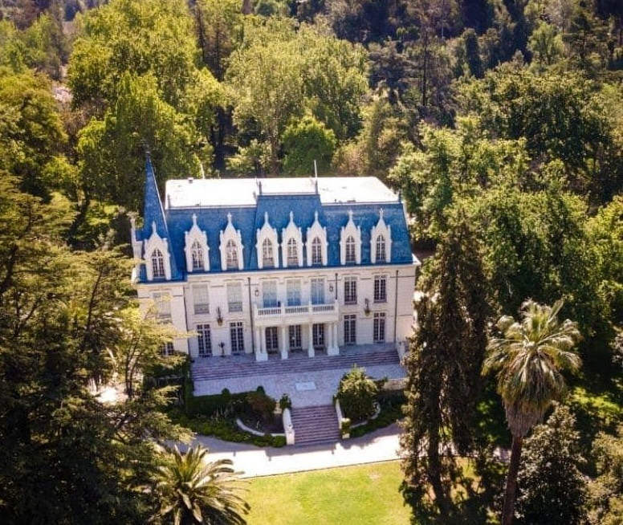

# Santiago 2026

Welcome to the website for the 18th meeting of the IFIP Working Group 2.16 on Language Design.

**Dates**: Sunday, March 22, evening
to
Friday, March 27, noon.

**Place**: Santiago, Chile 

**Organizer**: Éric Tanter, University of Chile

[Las Majadas de Pirque](https://lasmajadas.cl/en/): a beautiful historical house in a large private park filled with old trees, a modern infrastructure, and plenty of cozy spots to socialize. 

## Table of Contents

- [Registration, Hotel Booking, and Payment](#registration-hotel-booking-and-payment)
  - [Registration](#registration)
  - [Hotel Booking](#hotel-booking)
  - [Room Sharing and Guests](#room-sharing-and-guests)
  - [Outing](#outing) [updated Feb 26]
- [Travel](#travel)
  - [Airport](#airport)
  - [Customs Rules for Plant & Animal Products](#customs-rules-for-plant--animal-products) [Added Feb 26]
  - [Hotel](#hotel)
  - [Staying in Santiago](#staying-in-santiago)
- [Frequently Asked Questions](#frequently-asked-questions)
  - [What facilities are available at Las Majadas?](#what-facilities-are-available-at-las-majadas)
  - [How to purchase metro & bus tickets in Santiago?](#how-to-purchase-metro--bus-tickets-in-santiago)
  - [What about taxis (and alternatives)?](#what-about-taxis-and-alternatives)
  - [What will the weather be like?](#what-will-the-weather-be-like)
  - [Power and video adapters?](#power-and-video-adapters)
  - [Will there be dinner and socializing on Sunday evening?](#will-there-be-dinner-and-socializing-on-sunday-evening)
  - [Can I check-in late?](#can-i-check-in-late)
  - [What about interesting tourist destinations in Chile?](#what-about-interesting-tourist-destinations-in-chile)

## Registration, Hotel Booking, and Payment

Registration is a 3-step process:

1. **Fill out the [registration form](https://forms.gle/P29mAG39cwUQ3ZuX7)**
2. **Pay the registration fee**
3. **Book a hotel room**

All payments are to the hotel Las Majadas. See below for the details.

### Registration

After filling out the [registration form](https://forms.gle/P29mAG39cwUQ3ZuX7), you should proceed to pay the registration fee.

The registration fee includes meeting room & equipment, coffee breaks, meals, and outing. The first included meal is lunch on Monday, the last included meal is lunch on Friday.

**Pay your registration via this [online payment form](https://www.webpay.cl/form-pay/106)**.

The form is in Spanish so:
* *Correo*: your email
* *Nombre*: your full name---*add `(WGLD)` at the end, to facilitate tracking by the hotel*
* *Rut*: if you are not Chilean, put `555555555` (9 digits)---that's the standard wildcard for foreigners (great design 😉)
* *Monto*: `720000` (seven hundred twenty thousand)---that's 750 USD converted in Chilean pesos (CLP).

Then click on the "Pagar" button. You'll be directed to another page where you can choose the payment method; click on "Tarjetas" (cards). They accept Visa, Mastercard, and Amex.

> **IMPORTANT:** After validating the payment, send your payment receipt in PDF to [wgld26@dcc.uchile.cl](mailto:wgld26@dcc.uchile.cl)

### Hotel Booking

The price per night is 202 USD (can be shared, see below). Do not book your room directly on the hotel website, otherwise you won't get this reduced rate. Once the hotel has received your [registration payment](#registration) receipt, they will contact you in order to proceed with the booking of your room. 

> *Don't worry if the hotel isn't very fast at getting back to you regarding the room booking. As long as you've done the previous steps (filling the form, paying the registration fee, and [sending your receipt](mailto:wgld26@dcc.uchile.cl), you're good).*

They will ask for your credit card details as a means of securing your booking. The actual guarantee on the card will activate on March 2nd. The payment itself will be done upon checkout, as usual. 

If you are uncomfortable sharing your card details via a good old PDF form, they also have an [online booking option with WeTravel](https://www.wetravel.com/trips/fcfm-u-de-chile-wgld-30-px-22-a-27-marzo-2026-hotel-las-majadas-0345337136). If you use this option, make sure to [email us your confirmation](mailto:wgld26@dcc.uchile.cl).

>Note that at checking time, you will need to present your *travel entry receipt*, a small paper slip provided by the Chilean authorities at the airport. This receipt is important for exiting the country, so *keep it safe!*

### Room Sharing and Guests

It is possible to share a room with another participant. If so, mention it when you are contacted by the hotel regarding your room. Up to 2 persons can share a room, at no extra cost.

If you bring along a guest (not a WGLD meeting participant), [contact me by email](mailto:etanter@dcc.uchile.cl?subject=[WGLD]%20guest), indicating the days/meals they intend to have and if they will join the outing, so that I can calculate and confirm the amount to be paid. The payment will have to be carried out through the same online payment form as your registration.

### Outing 

The registration fee includes an outing. On Wednesday afternoon, we'll go for a 1h30~ walk in the surroundings (pre-cordillera). A bus will take us to the trail, which is only 15 min from the hotel. 

Meeting time at the Majadas is 2:30pm on Wednesday. 
We should be back to the Majadas by 5pm. 

We are also planning a wine tasting session at the Majadas that day, around 6:30pm. This activity is optional, at an extra cost. It includes a tasting of 3-4 "innovating" Chilean wines.

## Travel

### Airport

It's easy, there's just one option: Santiago de Chile (SCL).

### Customs Rules for Plant & Animal Products

Chile has very strict biosecurity controls. You'll need to fill in a declaration indicating whether you're carrying plant and animal products (even packaged ones). Customs officers and their dogs check baggage (including carry-on) at the airport.

**Allowed:** Packaged foods like cookies, coffee, tea, spices, canned goods, oils, dairy products (cheese, butter, cream), processed/cured meats and sausages, nuts, and dried fruits. 

**Not allowed at all:** Fresh fruits and vegetables, raw or fresh meat, honey.

A simple rule: unless you're sure you carry nothing at all, **declare** that you are carrying some products. When they ask, they'll tell you whether it's ok or not. If they detect a product that is not ok, they confiscate it without any further hassle. But if you do not declare and carry some product, the fine can be steep. Better safe than sorry!

### Hotel

The hotel Las Majadas is [located South of Santiago](https://www.google.com/maps/dir//Las+Majadas,+Hotel+%26+Centro+de+Reuniones+-+Jose+Julio+Nieto+s%2Fn,+Loteo+Parque+Las+Majadas,+Pirque,+Regi%C3%B3n+Metropolitana/@-33.6335686,-70.5398451,15z/data=!4m9!4m8!1m0!1m5!1m1!1s0x9662d6058305213b:0xb9d06cafacae1603!2m2!1d-70.536402!2d-33.634182!3e0), just on the outside of the city. There is not much within walking distance of the hotel, so if you're spending more time in Santiago, I would recommend not staying longer at Las Majadas, but in the city itself (see below about [Staying in Santiago](#staying-in-santiago)).

If you're coming straight from the airport, then the most convenient is to arrange a (private) transfer via [Transvip](https://transvip.cl) or any other official booth at the airport (situated after customs, *before* exiting to the hall). Avoid other taxi offers that you'll get when you arrive in the hall. The trip should take ~1h.

If you're coming from Santiago, you can get to Las Majadas by Uber, Cabify, Didi, or standard taxis. I would recommend using an app, this way you're sure that the driver won't trick you (they tend to be good at this). This should take ~40 min depending on the time of day and traffic conditions (up to 1h).

If you want a cheaper (but not necessarily faster) way to commute between Santiago
and Las Majadas, you can take Metro Line 4 down to the Puente Alto station, and then take a car (Uber/etc.) to Las Majadas. I don't recommend this option, except maybe at peak hours---it's safer and easier to grab a car from the central areas of Santiago (see below about [Staying in Santiago](#staying-in-santiago)).

Car rentals are also an option of course. Both Waze and Google Maps work very well here.

### Staying in Santiago

Santiago is a geographically vast city, divided in "comunas". The standard of living and level of safety varies greatly from comunas to comunas. I recommend finding a hotel or rental in one of the following comunas:

* Providencia
* Ñuñoa
* Vitacura
* Las Condes

The ordering is not random: many visitors have found staying in Providencia very convenient. You might want to make sure you have a metro station within walking distance. Specifically, a safe bet would be any hotel with good ratings located between Manuel Montt and Tobalaba metro stations (Line 1), between Avenida Andres Bello and Avenida Nueva Providencia (approx). 

To hang out, in addition to the Providencia neighborhood, a nice option is Barrio Italia, as well as 
Plaza Ñuñoa is also quite nice. Ñuñoa in general is a bit more residential than Providencia, but now has metro lines, so this is changing and it's easy to commute between these sectors.

Vitacura and Las Condes are more upscale neighborhoods, and you'll find the usual big hotels, malls, etc. in these comunas.

Santiago Centro (the historical center) is not so great/safe to stay, depending on your expectations. It is entirely fine (and recommended!) to visit, though, as long as you apply basic safety guidelines. 

Don't hesitate to [ask me](mailto:etanter@dcc.uchile.cl?subject=[WGLD]%20question) if in doubt.

## Frequently Asked Questions
*last updated: Nov 3, 2025*

### What facilities are available at Las Majadas?

Free of charge, we will have access to a small gym (with a couple of machines), a wet and dry sauna, an outdoor pool, and bikes to ride in the park. 

They also have a Spa section that offers massages, for which you'd have to pay separately.

### How to purchase metro & bus tickets in Santiago?

As a foreigner, your only option is to acquire a physical card, called a Bip card (*tarjeta Bip!*). You can buy a Bip card at any metro station (and some shops with the "Bip!" sign), with an initial amount. The card is rechargeable. It works for both metro and buses. 

If possible, favor metro, but the grid is rather sparse, so you may have to take a bus (or a car, see below). 

Google Maps app has great knowledge of the public transportation network in Santiago, so this should probably be your go-to solution to figure out how to get anywhere.

*UPDATE: as of Feb 13, contactless payment with bank cards will be available in all metro stations. If it works as advertised, this should be the most convenient option, as you don't need to acquire a Bip card.*

### What about taxis (and alternatives)?

Taxi drivers tend to be fishy with foreigners. If you don't know your way, be sure to follow the route on some map app. If you pay in cash, be super clear about the bill(s) your handing the driver, so that he does not pretend you gave a lower amount afterward, and double-check your change. Most taxis should have a machine for card payments, but you may want to confirm before boarding.

For all these reasons, I would highly recommend using ride-sharing apps instead. Uber, Didi, and Cabify are very active and reliable in Santiago, and the prices are often more interesting. If you have several of these apps, don't hesitate to check on each, prices vary.

On these apps, you can also request standard taxis, and then you have the guarantee of smooth payment (via the app), no journey tricks, etc.

### What will the weather be like?

March is the end of the summer, and is usually a very pleasant period, sunny and warm. For people familiar with Salt Lake City and its surroundings, it's quite similar (dry, mountains around, etc.).

Asking Google shows the following monthly averages so you can get an idea:

| Month | High / Low (°C) | Rain |
|---|---|---|
| Feb | 30° / 11° | 0 days| 
| Mar | 28° / 10° | 0 days|
| Apr | 24° / 7°  | 1 day|

Note that it's rather fresh at night (especially that we'll be rather close to the mountains and in the outside of the city). 

Not much use for an umbrella normally 😅.

### Power and video adapters?

[See here for power plugs](https://www.power-plugs-sockets.com/chile/).

The hotel has both HDMI and USB-C cables for the projector.

### Will there be dinner and socializing on Sunday evening?

Yes, although not included in the registration. 

The hotel restaurant opens 7pm-10pm for dinner, and the tavern (pub) is open 10:30pm-2:00am.

### Can I check-in late?

The hotel can accommodate checking in at any time.

### What about interesting tourist destinations in Chile?

There's a ton of wonderful places around, from the desert and salt lakes of the North to the glaciars and fjords of the South, with volcanoes along the 4000+ kms of Andes mountain, and the same length of Pacific coast. And that's without talking about Easter Island or the Antartic. 

ChatGPT cooked a mix for us:

Anyway, I can't really do justice to this dimension here. 
There's abundant information on the web, so enjoy your planning!

Don't hesitate to [contact me](mailto:etanter@dcc.uchile.cl?subject=[WGLD]%20travel) if you have any question.

<!---

### Other questions about the hotel?

The [Serpiano hotel has an FAQ](https://www.serpiano.ch/en/faq.php) with more info.
Also, they offer bike rentals, and they have a spa you may want to try out.

## Visiting the Region

Info about Lugano, Ticino, Switzerland:

[https://icer2022.acm.org/attending/Location%3A+Lugano%2C+Ticino%2C+Switzerland](https://icer2022.acm.org/attending/Location%3A+Lugano%2C+Ticino%2C+Switzerland)

Explore the Region (e.g., if someone wants to connect this with a vacation in Ticino or Switzerland overall):

[https://icer2022.acm.org/attending/things-to-do-in-the-region](https://icer2022.acm.org/attending/things-to-do-in-the-region)

There are a couple of videos on the above sites that might make sense checking out.

-->