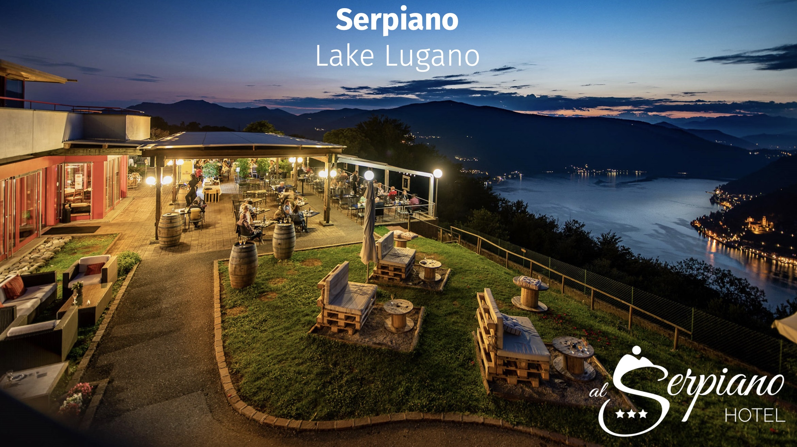
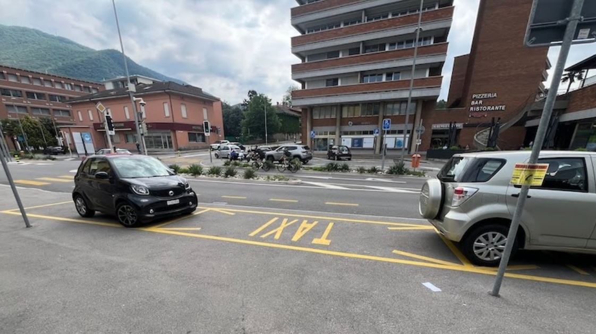
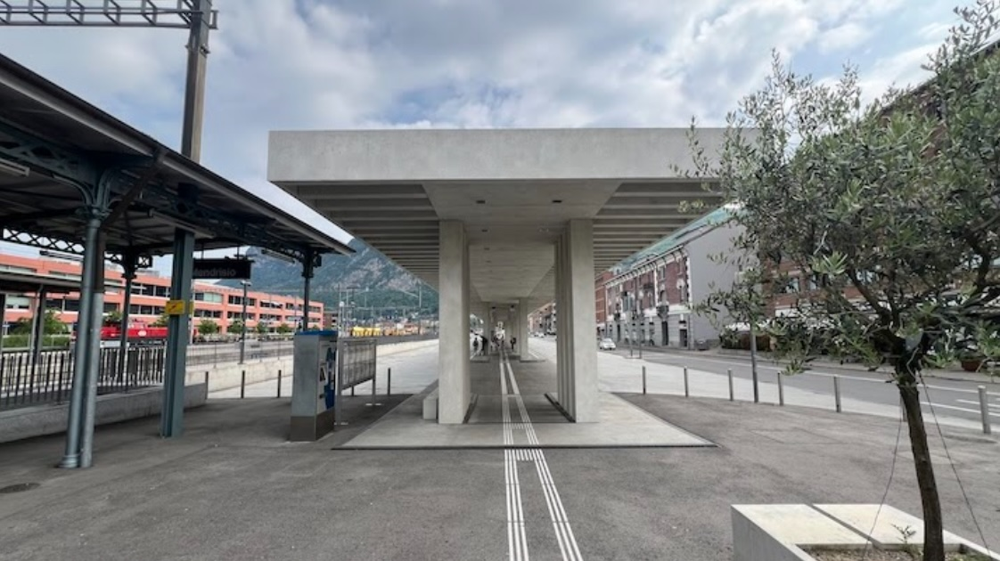

# Serpiano 2025

Welcome to the website for the 17th meeting of IFIP Working Group 2.16.

**Dates**: Sunday, March 30, evening
to
Friday, April 4, noon.

**Place**: Serpiano*, Switzerland

**Organizer**: Matthias Hauswirth, USI

*) Serpiano is a somewhat remote location in Switzerland (in walking distance from the border with Italy), with a hotel overlooking Lake Lugano.

## Meeting Registration

Registration is a 3-step process:

1. **Fill out the [registration form](https://docs.google.com/forms/d/e/1FAIpQLScloMFZyd6qbnZ-bnm9bOluAgoOhQxCZQhD_1HG9M4H-WHScQ/viewform?usp=header)**
2. **Book a hotel room** -- see below, by email to hotel -- you will pay the hotel
3. **Pay the meeting package** -- see below, by online form -- you will pay USI

## Hotel Booking & Payment

Hotel room bookings must be done by writing directly to the hotel at
[info@serpiano.ch](mailto:info@serpiano.ch) (no other channels) mentioning IFIP (USI).

[//]: # (**by XXXX**. Availability after that is not guaranteed.)

The hotel is holding a block of rooms for us for CHF 99/night for the duration of our meeting
(incl. breakfast; an extraordinarily low rate for this time of the year in our area).
Book your room according to your travel preferences.
The hotel has great views, but it is somewhat remote.
If you want to spend some more days before or after in Ticino,
you might want to spend those extra nights in the places you want to visit
e.g., in Lugano, Locarno, or Ascona.

The hotel has a large free parking lot ([Street View](https://maps.app.goo.gl/2stTc6maEMT9fugo7)).
You can find some more info on their [FAQ page](https://www.serpiano.ch/en/faq.php).

Note that currently the hotel is off-season, and they are operating on a limited schedule.
They might not immediately answer your emails, but they will get back to you.

## Meeting Package Payment

Payment for the meeting package is separate from the hotel room booking. The meeting package includes meeting room & equipment, coffees, meals (with water, excl. drinks), banquet, and outing. The first included meal is lunch on Monday, the last included meal is lunch on Friday.

For the outing on Wednesday afternoon we plan a visit to the Monte San Giorgio Fossil Museum in Meride (Monte San Giorgio is a UNESCO World Heritage Site and one of the most important fossil deposits in the world).

If you come alone, simply pick "Meeting registration & Outing".

If you bring along a guest, they will have to pay their meals separately directly with the hotel.
On top of that, if you would like to bring the guest along to the outing,
you can pay for your full meeting package and the guest's outing in one go:
pick "Meeting registration & Outing (plus guest)".
You can also pay for the guest's outing separately: pick "Outing (guest only)".

[Meeting Package Payment](https://secure.usi.ch/IFIP/reg.php) (online registration and payment form at USI)

## Travel

Airports:

* Milano Malpensa (MXP) in Italy – closest, with direct train connection (1 h 15 min, every hour) to Lugano

* Milano Linate (LIN) in Italy – harder to reach (train/bus combination)

* (Milano) Bergamo (BGY) in Italy – even harder to reach (longer train/bus combination)

* Zurich (ZRH) – with train connection to Lugano, all within Switzerland, partially scenic train ride through the alps and the world's longest train tunnel (2.5h, every 30 minutes)

The hotel has a page with directions to Serpiano:

[https://www.serpiano.ch/en/contact.php#directions](https://www.serpiano.ch/en/contact.php#directions)

The easiest is if you drive by car (your own, or rental).

To get there by public transportation requires three steps:

1. Get to **Mendrisio** by train

   * [Train from Lugano](https://t.ly/ZNNFP) (e.g., when arriving from Zurich) ~ 20 min

   * [Direct train from Milano Malpensa](https://t.ly/67Nz1) (MXP, Terminal 1, or Terminal 2) ~ 1 h 15 min

2. Get [from **Mendrisio** to **Meride, Paese** by bus](https://t.ly/Yx06P)

   * The yellow post bus, B 524, goes once per hour on Sundays

3. Get [from **Meride, Paese** to the **Serpiano hotel**](https://www.serpiano.ch/en/contact.php#directions) by shuttle

   * The hotel offers this pick-up service (the hotel page states CHF 30 one way, but they might charge more for single-person pickups -- it might be CHF 30/person if you pair up with someone), **between 9am and 5pm**, but you have to **order two days ahead of time**.

To the best of my knowledge, ride-sharing services like Uber don't operate around here. You could take a taxi (however taking it from the airport will be exorbitantly expensive, and even from Lugano will be overly expensive, and you won't find any in the small village of Meride, so **taking a taxi** from the Mendrisio train station [(info & reservations)](https://www.taxi-mendrisio.com/en/services-4/about-6-1) should be the best taxi option).

**Taxi spots in front of Mendrisio train station** | **Bus island at Mendrisio train station**
 | 
No taxis waiting there, make reservations! | The yellow AutoPostale 524 to Meride, Paese stops here.

<iframe src='https://map.geo.admin.ch/embed.html?lang=en&topic=ech&bgLayer=ch.swisstopo.pixelkarte-farbe&layers=ch.swisstopo.zeitreihen,ch.bfs.gebaeude_wohnungs_register,ch.bav.haltestellen-oev,ch.swisstopo.swisstlm3d-wanderwege,ch.astra.wanderland-sperrungen_umleitungen,KML%7C%7Chttps:%2F%2Fpublic.geo.admin.ch%2Fapi%2Fkml%2Ffiles%2FtHAusNK7RCuyTzGfMTKwaA&layers_opacity=1,1,1,0.8,0.8,1&layers_visibility=false,false,false,false,false,true&layers_timestamp=18641231,,,,,&E=2717808.57&N=1089200.04&zoom=4' width='500' height='375' frameborder='0' style='border:0' allow='geolocation'></iframe>

&nbsp;

## Frequently Asked Questions

### What if I arrive after 22:00 at the hotel?

The hotel reception is open until 10pm.
Please notify the hotel in advance if you plan to arrive after 10pm.

### How to purchase train & bus tickets?

I highly recommend installing the [SBB Mobile App](https://www.sbb.ch/en/travel-information/apps/sbb-mobile.html) to get your tickets for public transportation (trains, tram, bus, ...) in Switzerland and even to/from nearby Italy (e.g., to/from Milano Malpensa airport). The app includes the schedule with real-time information on possible delays. Alternatively, you could also buy tickets on the [SBB web site](https://www.sbb.ch/en).

Note that on the App and the web site you can buy tickets that combine multiple segments, even across the border (e.g., from Malpensa airport all the way to Meride, Paese).

At [Mendrisio station](https://www.sbb.ch//en/travel-information/stations/find-station/station.5305.mendrisio.html), like at every train station, there will be a [ticket machine](https://www.sbb.ch/en/travel-information/stations/services-ticket-machine/sbb-ticket-machine.html) (accepting payment also by credit card), but the ticket counter is **closed** on Sunday.

At the [Meride, Paese bus stop](https://maps.app.goo.gl/zCtLbqkQeHvyf9CA7), there is **no ticket machine** (it's just a sign in a small village). However, you will get a free "[Ticino Ticket](https://www.mendrisiottoturismo.ch/en/pianifica/come-muoversi/ticino-ticket.html)" from the hotel when you check in, and that ticket is valid for public transportation within Ticino (but not all the way to Italy/Malpensa) up to midnight on the day of checkout.

### How to pay for a taxi?

Taxis should accept credit cards (MasterCard, Visa).

### Where do I find taxis and busses at the Mendrisio train station?

While there are three marked taxi parking spots right in front of the station (see photo above), there don't seem to be any taxis waiting. Reserve your taxi ahead of time (e.g., [Alpha Taxi Mendrisio](https://www.taxi-mendrisio.com/en/services-4/about-6-1)). If you didn't make a reservation, you might still be able to call them to get them to pick you up.

There is a **bus** island right at the train station (on the side of the station building, in the direction towards Lugano, see photo above). The bus only gets you to the village of Meride. You still need to get from there to the hotel. Their "shuttle" from Meride to the hotel is CHF 30, and you should have reserved it two days ahead of time. (I suspect the "shuttle" is just a taxi they call for you. It's probably so expensive because they need to first get to the little village of Meride, so you pay for much more than just the 5 km they actually carry you. You might want to walk from Meride to the hotel, but it's an hour-long walk through the woods...)

### How to drive to the hotel?

The last part of the street to the hotel is a [quite narrow, single-lane, curvy, paved road through the woods](https://maps.app.goo.gl/J1UGHZdHDAVd33uM7). If you encounter an oncoming car, you might have to back up a little to a spot where you can cross. There should be almost no traffic (the road pretty much ends at the hotel), so chances that you will encounter an oncoming car are rather small.

### Power and video adapters?

If possible, bring a power adapter (the [Swiss power plugs](https://en.wikipedia.org/wiki/SN_441011) are different from EU plugs) and an adapter for your laptop's video output. We probably will have an HDMI cable for the projector.

### What will the weather be like?

The [weather in our area](https://www.meteoswiss.admin.ch/local-forecasts/serpiano/6867.html#forecast-tab=weekly-overview) has been wetter than it used to be in the past. Bring an umbrella and a rain jacket.

### Will there be dinner and socializing on Sunday evening?

If you arrive before dinner (the hotel restaurant's dinner times are 18:30 - 21:00), you may want to have dinner at the hotel (Sunday dinner is not included in our package). Also, you can meet up at the bar, which is open 19:30 to 22:30.

If the weather is nice, it might be great to sit outside on the terrace with a view down onto the lake.

### Other questions about the hotel?

The [Serpiano hotel has an FAQ](https://www.serpiano.ch/en/faq.php) with more info.
Also, they offer bike rentals, and they have a spa you may want to try out.

## Visiting the Region

Info about Lugano, Ticino, Switzerland:

[https://icer2022.acm.org/attending/Location%3A+Lugano%2C+Ticino%2C+Switzerland](https://icer2022.acm.org/attending/Location%3A+Lugano%2C+Ticino%2C+Switzerland)

Explore the Region (e.g., if someone wants to connect this with a vacation in Ticino or Switzerland overall):

[https://icer2022.acm.org/attending/things-to-do-in-the-region](https://icer2022.acm.org/attending/things-to-do-in-the-region)

There are a couple of videos on the above sites that might make sense checking out.